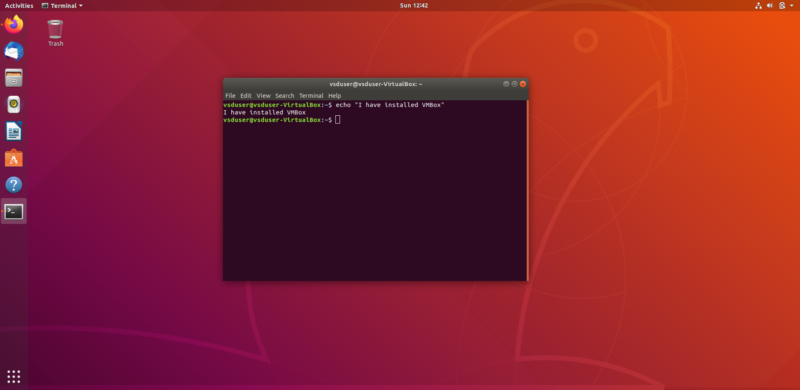
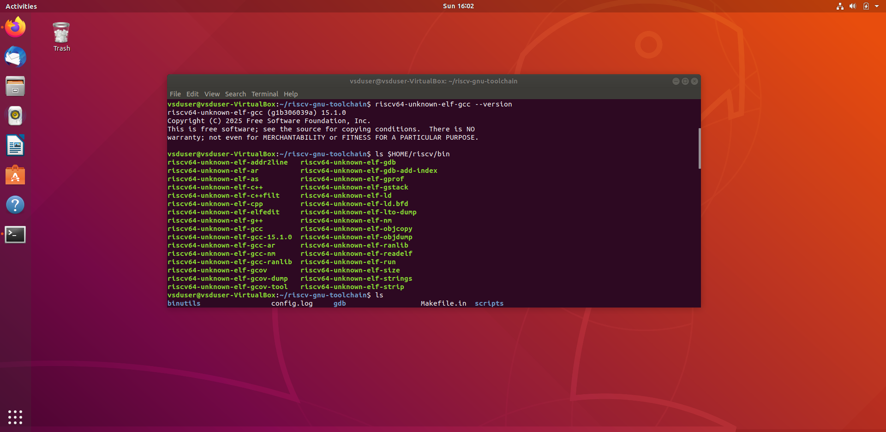
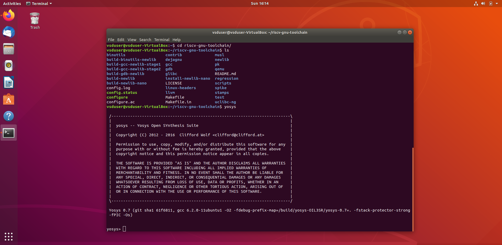
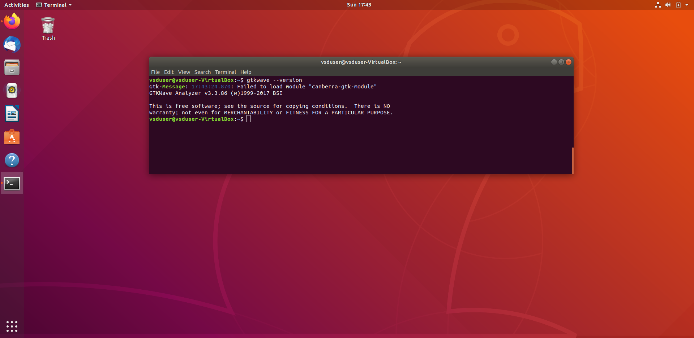
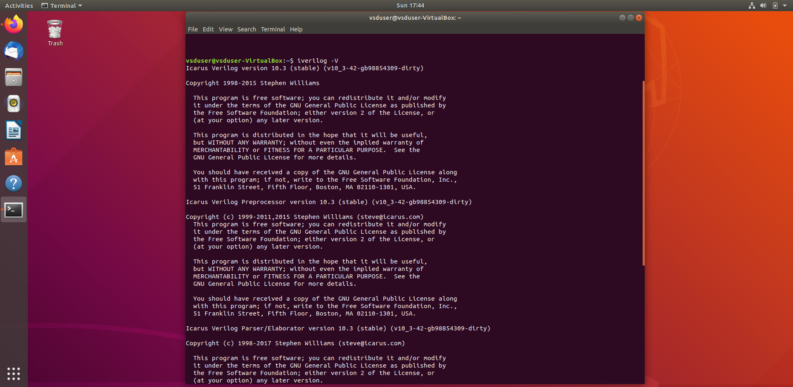
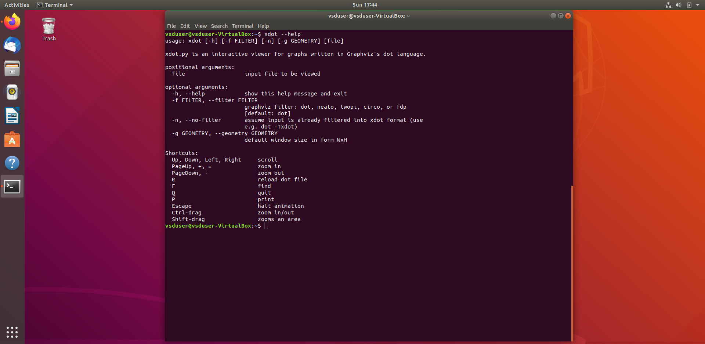

# Task 1 – Tool Installation

This task is to install all essential tools required for the internship:
- Ubuntu 20.04 on VirtualBox
- RISC-V GNU Toolchain
- GTKWave
- Yosys
- Icarus Verilog
- xdot

---

## 1. Install Ubuntu 20.04 LTS on Oracle VirtualBox

Ubuntu and VMBox Installation

> 

---

## 2. Install RISC-V GNU Toolchain

What is RISC-V GNU Toolchain?  
A free and open-source cross-compiler for C/C++. Supports ELF/Newlib and Linux-ELF builds.

### Commands:

```bash
sudo apt install git  
git clone https://github.com/riscv/riscv-gnu-toolchain
sudo apt-get install autoconf automake autotools-dev curl python3 python3-pip \
libmpc-dev libmpfr-dev libgmp-dev gawk build-essential bison flex texinfo gperf \
libtool patchutils bc zlib1g-dev libexpat-dev ninja-build git cmake \
libglib2.0-dev libslirp-dev
mkdir /opt/riscv
cd riscv-gnu-toolchain
./configure --prefix=/opt/riscv --with-arch=rv64i --with-abi=lp64 --enable-multilib
sudo make
```

Add to PATH:

```bash
gedit ~/.bashrc
# Add this line at the end
export PATH="$PATH:/opt/riscv/bin"
source ~/.bashrc
```

> 

---

## 3. Install Yosys

What is Yosys?  
Open-source synthesis tool for Verilog RTL. Converts Verilog to netlist formats.

### Commands:

```bash
git clone https://github.com/YosysHQ/yosys.git
cd yosys
sudo apt install make
sudo apt-get install build-essential clang bison flex \
libreadline-dev gawk tcl-dev libffi-dev git \
graphviz xdot pkg-config python3 libboost-system-dev \
libboost-python-dev libboost-filesystem-dev zlib1g-dev
make config-gcc
make
sudo make install
```

> 

---

## 4. Install GTKWave

What is GTKWave?  
Waveform viewer for `.vcd` and `.lxt` files.

### Command:

```bash
sudo apt update
sudo apt install gtkwave
```

> 

---

## 5. Install Icarus Verilog

What is Icarus Verilog?  
Simulator that compiles Verilog HDL files and generates `.vcd` output.

### Command:

```bash
sudo apt-get install iverilog
```

> 

---

## 6. Install xdot

Tool to visualize `.dot` files generated by Yosys.

### Command:

```bash
sudo apt install xdot
```

> 

