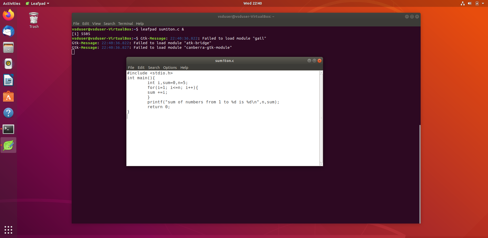
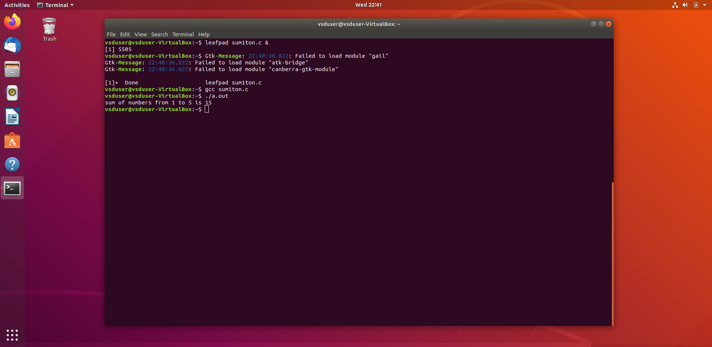
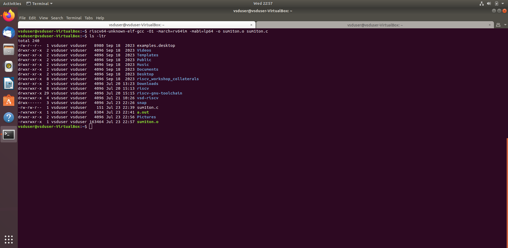
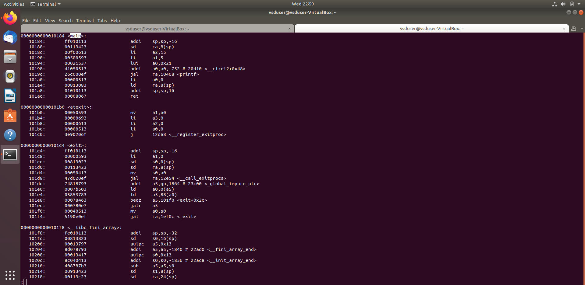
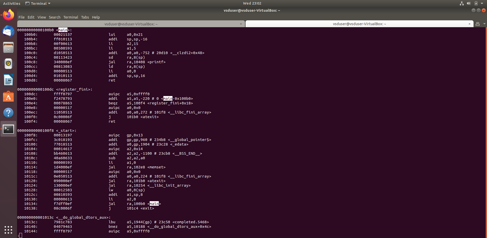

# Task 1.2 – RISC-V Assembly Analysis Using `objdump` with Compiler Optimizations

This task demonstrates compiling a simple C program using both native GCC and the RISC-V cross-compiler, and then analyzing the generated object files using `objdump` under different compiler optimization levels.

---

## Step 1: Write the C Program

Open a new file using `leafpad`:

```bash
leafpad sum1ton.c &
```

Paste the following code:

```c
#include <stdio.h>
int main(){
    int i, sum = 0, n = 5;
    for(i = 1; i <= n; i++){
        sum += i;
    }
    printf("sum of numbers from 1 to %d is %d\n", n, sum);
    return 0;
}
```

> 

---

## Step 2: Compile and Run on x86 (Native GCC)

Compile using the default system compiler:

```bash
gcc sum1ton.c
./a.out
```

Expected output:

```text
sum of numbers from 1 to 5 is 15
```

> 

---

## Step 3: Compile with RISC-V GCC using `-O1`

Generate a RISC-V object file using the cross-compiler with moderate optimization:

```bash
riscv64-unknown-elf-gcc -O1 -march=rv64im -mabi=lp64 -o sum1ton.o sum1ton.c
```

> 

---

## Step 4: Inspect Object File with `objdump` (`-O1`)

Disassemble the object file:

```bash
riscv64-unknown-elf-objdump -d sum1ton.o | less
```

> 

---

## Step 5: Recompile with `-Ofast`

Recompile using aggressive optimization flags:

```bash
riscv64-unknown-elf-gcc -Ofast -march=rv64im -mabi=lp64 -o sum1ton.o sum1ton.c
```

> 

---

## Step 6: Inspect Optimized Object File (`-Ofast`)

Disassemble the recompiled object:

```bash
riscv64-unknown-elf-objdump -d sum1ton.o | less
```

> 

---

## Summary Table

| Step | Description                             | Output             | Screenshot                    |
|------|-----------------------------------------|---------------------|-------------------------------|
| 1    | Write C Program in Leafpad              | sum1ton.c           | `code_leafpad.png`            |
| 2    | Compile and run on x86                  | a.out               | `x86_output.png`              |
| 3    | Compile with RISC-V `-O1`               | sum1ton.o           | `compile_O1.png`              |
| 4    | Disassemble RISC-V object (`-O1`)       | —                   | `objdump_O1.png`              |
| 5    | Recompile with RISC-V `-Ofast`          | sum1ton.o (updated) | `compile_Ofast.png`           |
| 6    | Disassemble RISC-V object (`-Ofast`)    | —                   | `objdump_Ofast.png`           |

---

## Files Included

- `sum1ton.c` – Source code file
- `sum1ton.o` – RISC-V compiled object file (can be recompiled)
- `screenshots/` – Directory containing all step screenshots

