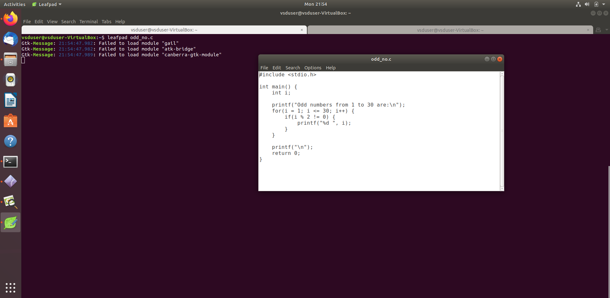
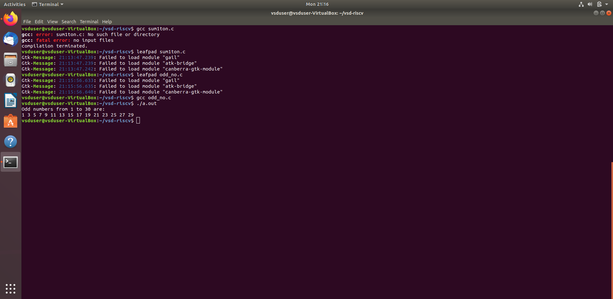
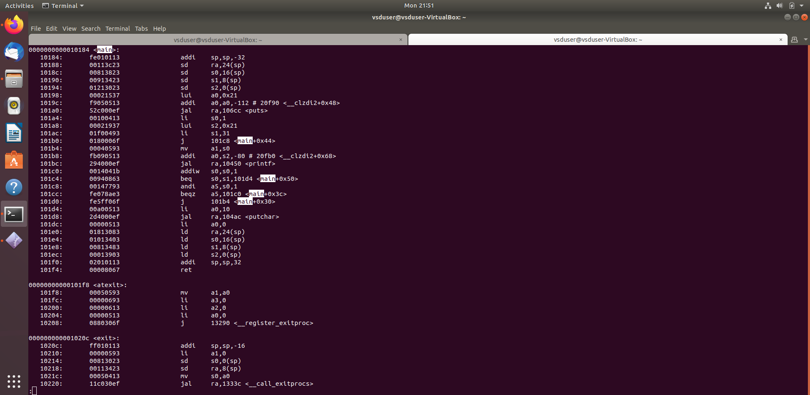
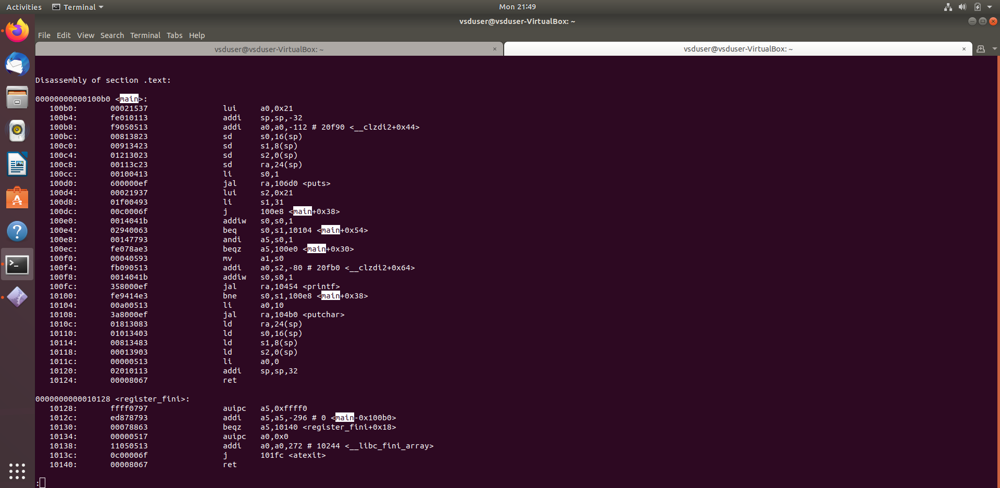
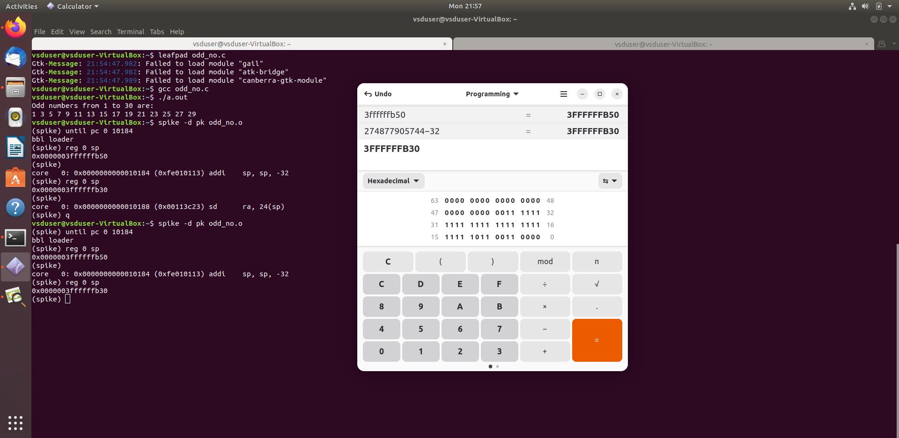
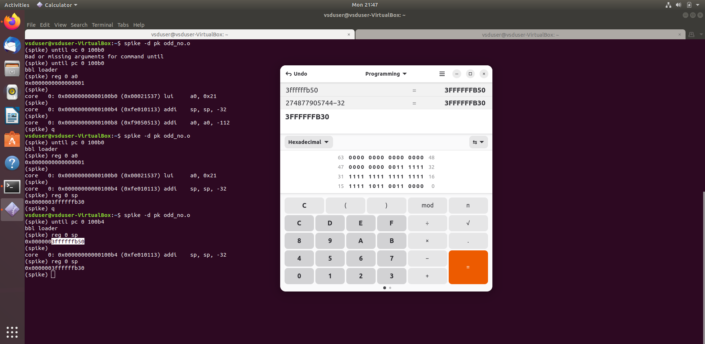

# Task 2 – RISC-V Assembly and Spike Debugging (Odd Numbers Program)

This task involves writing a simple C program to print odd numbers from 1 to 30, compiling it using both native `gcc` and the RISC-V toolchain with different optimization flags (`-O1` and `-Ofast`), analyzing the generated RISC-V assembly using `objdump`, and debugging the binary using `spike` to observe stack pointer changes and instruction flow.

## Step 1: C Program – `odd_no.c`

```c
#include <stdio.h>

int main() {
    int i;
    printf("Odd numbers from 1 to 30 are:\n");
    for(i = 1; i <= 30; i++) {
        if(i % 2 != 0) {
            printf("%d ", i);
        }
    }
    printf("\n");
    return 0;
}
```



## Step 2: Native Compilation and Execution

Compile using GCC:

```bash
gcc odd_no.c
./a.out
```

Expected output:

```
Odd numbers from 1 to 30 are:
1 3 5 7 9 11 13 15 17 19 21 23 25 27 29
```



## Step 3: RISC-V Compilation

Using RISC-V toolchain to compile with different optimization levels.

With -O1 optimization:

```bash
riscv64-unknown-elf-gcc -O1 -march=rv64im -mabi=lp64 -o odd_no.o odd_no.c
```

With -Ofast optimization:

```bash
riscv64-unknown-elf-gcc -Ofast -march=rv64im -mabi=lp64 -o odd_no.o odd_no.c
```

## Step 4: Disassembly Using objdump

```bash
riscv64-unknown-elf-objdump -d odd_no.o | less
```

-O1 output: 
Start of main: `0x0000000000010184` 


-Ofast output: 
Start of main: `0x00000000000100b0` 


## Step 5: Spike Debugger

Run spike in debug mode:

```bash
spike -d pk odd_no.o
```

### For -O1 binary:

Start execution at main:

```bash
(spike) until pc 0 10184
(spike) reg 0 sp
```

Initial output:

```
0x0000003ffffffb50
```

Press Enter to execute one instruction:

```
core   0: 0x0000000000010184 (0xfe010113) addi sp, sp, -32
(spike) reg 0 sp
0x0000003ffffffb30
```

Calculation:

```
0x3ffffffb50 - 0x20 = 0x3ffffffb30
```

  


### For -Ofast binary:

Repeat same steps using starting address 0x100b0:

```bash
(spike) until pc 0 100b0
(spike) reg 0 sp
```



## Summary Table

| Step            | Tool                        | Purpose                                         |
|-----------------|-----------------------------|-------------------------------------------------|
| Code Writing    | C                           | Print odd numbers from 1 to 30                 |
| Native Compile  | gcc                         | Validate functionality on host system          |
| RISC-V Compile  | riscv64-unknown-elf-gcc     | Generate target architecture binary            |
| Disassembly     | riscv64-unknown-elf-objdump | View RISC-V assembly of compiled program       |
| Debugging       | spike -d                    | Trace register and instruction flow            |

## Observations

- Verified stack pointer (`sp`) decreased by 32 using `addi sp, sp, -32`
- Compared instruction layout between `-O1` and `-Ofast` optimizations
- Learned to interpret PC, SP, and control flow during RISC-V execution

