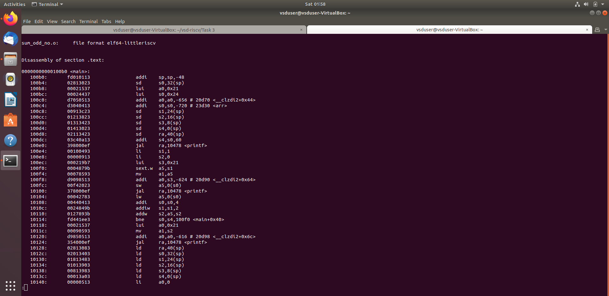

# Task 3 – RISC-V Instruction Format and 32-bit Encoding

This task involves identifying and decoding 15 unique RISC-V instructions from a compiled ELF binary. Each instruction is disassembled, and its format is analyzed based on the RISC-V specification. This includes determining the instruction type (R/I/S/B/U/J), extracting fields such as opcode, funct3, rs1, rs2, rd, and immediate values, and representing the 32-bit instruction layout.


## RISC-V Instruction Formats

### 1. Instruction Format Types

| Type   | Purpose                         | Typical Instructions     |
|--------|----------------------------------|---------------------------|
| R-type | Register arithmetic              | add, sub, and, sll        |
| I-type | Immediate arithmetic, loads      | addi, lw, jalr            |
| S-type | Store to memory                  | sw, sb, sh                |
| B-type | Conditional branches             | beq, bne, blt             |
| U-type | Load immediate to upper bits     | lui, auipc                |
| J-type | Jumps with link                  | jal                       |

---

### 2. Field Layout by Format


#### R-Type

| funct7 | rs2 | rs1 | funct3 | rd | opcode |
|--------|-----|-----|--------|----|--------|
| 7 bits |  5  |  5  |   3    | 5  |   7    |

Used for register-to-register ALU operations.

#### I-Type

| imm[11:0] | rs1 | funct3 | rd | opcode |
|-----------|-----|--------|----|--------|
|  12 bits  |  5  |   3    | 5  |   7    |

Used for immediate arithmetic, loads, jalr, and system instructions.

#### S-Type

| imm[11:5] | rs2 | rs1 | funct3 | imm[4:0] | opcode |
|-----------|-----|-----|--------|----------|--------|
|   7 bits  |  5  |  5  |   3    |   5      |   7    |

Used for memory store operations.

#### B-Type

| imm[12] | imm[10:5] | rs2 | rs1 | funct3 | imm[4:1] | imm[11] | opcode |
|---------|-----------|-----|-----|--------|-----------|----------|--------|
| 1 bit   | 6 bits    | 5   | 5   | 3      | 4 bits    | 1 bit   | 7 bits |

Used for conditional branches.

#### U-Type

| imm[31:12] | rd | opcode |
|------------|----|--------|
|  20 bits   | 5  | 7 bits |

Used for upper immediate operations.

#### J-Type

| imm[20] | imm[10:1] | imm[11] | imm[19:12] | rd | opcode |
|---------|-----------|---------|-------------|----|--------|
| 1 bit   | 10 bits   | 1 bit   | 8 bits      | 5  | 7 bits |

Used for jump and link.

---

### 3. Common Instructions and Encodings

#### Arithmetic (R-Type)

```assembly
add x1, x2, x3    # Adds x2 + x3 → x1
```

- opcode: `0110011`  
- funct3: `000`  
- funct7: `0000000`

#### Immediate (I-Type)

```assembly
addi x1, x2, 10   # Adds x2 + 10 → x1
```

- opcode: `0010011`  
- funct3: `000`

#### Load/Store

```assembly
lw x5, 4(x6)      # Load word from x6 + 4 (I-type)
sw x5, 8(x6)      # Store x5 at x6 + 8 (S-type)
```

#### Branch

```assembly
beq x1, x2, offset  # Branch if equal
```

#### Upper Immediate

```assembly
lui x3, 0x10000     # Sets upper 20 bits of x3
auipc x4, 0x20000   # PC-relative address generation
```

#### Jump

```assembly
jal x1, offset      # Jump to offset, store return address in x1
```

---

### 4. Instruction Field Extraction (in C/C++)

#### Immediate Extraction (I-Type)

```c
uint32_t imm_i = (instruction >> 20) & 0xFFF;
```

#### U-Type Immediate

```c
uint32_t imm_u = instruction & 0xFFFFF000;
```

#### B-Type Immediate (Reassembled from fields)

```c
imm = ((instruction >> 31) & 0x1) << 12 |
      ((instruction >> 25) & 0x3F) << 5 |
      ((instruction >> 8) & 0xF) << 1 |
      ((instruction >> 7) & 0x1) << 11;
```

---

### 5. Optional Extensions in RV32I

| Extension | Description                    | Example Instructions       |
|-----------|--------------------------------|-----------------------------|
| M         | Integer Multiply/Divide        | mul, div, rem               |
| A         | Atomics                        | lr.w, sc.w                  |
| F/D/Q     | Floating-Point (32/64/128-bit) | flw, fsd                    |
| C         | Compressed (16-bit)            | c.addi, c.sw, c.jal         |
| Zicsr     | CSR Access/Manipulation        | csrrw, csrrs, csrrc         |


## Source C Code

The following C code was compiled using the RISC-V GCC toolchain to generate ELF and disassembly for instruction decoding.

```c
#include <stdio.h>

int arr[15];

int main() {
    int i, sum = 0;

    for(i = 0; i < 15; i++) {
        arr[i] = 2 * i + 1;
    }

    for(i = 0; i < 15; i++) {
        if (arr[i] % 2 != 0) {
            printf("%d ", arr[i]);
            sum += arr[i];
        }
    }

    printf("\nSum = %d\n", sum);

    return 0;
} ```

---

## RISC-V Instruction Breakdown


---

### 1. Instruction: `lui a0, 0x21`


- **Opcode**: 0110111 (7 bits)
- **rd (a0 = x10)**: 01010 (5 bits)
- **Immediate (0x21 << 12)**: 00000000001000010000 (20 bits)

**Machine Code**: `00021537`  
**Type**: U-type

**Bitwise Layout**:  
`00000000001000010000 01010 0110111`

---

### 2. Instruction: `addi sp, sp, -32`


- **Opcode**: 0010011 (7 bits)
- **funct3**: 000
- **rs1 (sp = x2)**: 00010
- **rd (sp = x2)**: 00010
- **Immediate (-32)**: 111111111000

**Machine Code**: `fe010113`  
**Type**: I-type

**Bitwise Layout**:  
`111111111000 00010 000 00010 0010011`

---

### 3. Instruction: `addi a0, a0, -112`


- **Opcode**: 0010011
- **funct3**: 000
- **rs1 (a0 = x10)**: 01010
- **rd (a0 = x10)**: 01010
- **Immediate (-112)**: 111110010000

**Machine Code**: `f9050513`  
**Type**: I-type

**Bitwise Layout**:  
`111110010000 01010 000 01010 0010011`

---

### 4. Instruction: `sd s0, 16(sp)`

- **Opcode**: 0100011
- **funct3**: 011
- **rs1 (sp = x2)**: 00010
- **rs2 (s0 = x8)**: 01000
- **Immediate (16)**: imm[11:5]=0000000, imm[4:0]=10000

**Machine Code**: `00813823`  
**Type**: S-type

**Bitwise Layout**:  
`0000000 01000 00010 011 10000 0100011`

---

### 5. Instruction: `sd s1, 8(sp)`

- **Opcode**: 0100011
- **funct3**: 011
- **rs1**: 00010 (sp)
- **rs2**: 01001 (s1)
- **Immediate (8)**: imm[11:5]=0000000, imm[4:0]=01000

**Machine Code**: `00913423`  
**Type**: S-type

**Bitwise Layout**:  
`0000000 01001 00010 011 01000 0100011`

---

### 6. Instruction: `sd s2, 0(sp)`

- **Opcode**: 0100011
- **funct3**: 011
- **rs1**: 00010 (sp)
- **rs2**: 10010 (s2)
- **Immediate (0)**: 000000000000

**Machine Code**: `01213023`  
**Type**: S-type

**Bitwise Layout**:  
`0000000 10010 00010 011 00000 0100011`

---

### 7. Instruction: `sd ra, 24(sp)`

- **Opcode**: 0100011
- **funct3**: 011
- **rs1**: 00010 (sp)
- **rs2**: 00001 (ra)
- **Immediate (24)**: imm[11:5]=0000000, imm[4:0]=11000

**Machine Code**: `00113c23`  
**Type**: S-type

**Bitwise Layout**:  
`0000000 00001 00010 011 11000 0100011`

---

### 8. Instruction: `li s0, 1` → Pseudo-instruction  
> Real: `addi s0, x0, 1`

- **Opcode**: 0010011
- **funct3**: 000
- **rs1**: 00000 (x0)
- **rd**: 01000 (s0)
- **Immediate**: 000000000001

**Machine Code**: `00100413`  
**Type**: I-type

**Bitwise Layout**:  
`000000000001 00000 000 01000 0010011`

---

### 9. Instruction: `jal ra, 106d0 <puts>`

- **Opcode**: 1101111
- **rd**: 00001 (ra)
- **Immediate**: 000000000110000000000 (offset format)

**Machine Code**: `600000ef`  
**Type**: J-type

**Bitwise Layout**:  
`imm[20|10:1|11|19:12] 00001 1101111`

---

### 10. Instruction: `lui s2, 0x21`

- **Opcode**: 0110111
- **rd (s2 = x18)**: 10010
- **Immediate**: 00000000001000010000

**Machine Code**: `00021937`  
**Type**: U-type

**Bitwise Layout**:  
`00000000001000010000 10010 0110111`

---

### 11. Instruction: `li s1, 31` → Pseudo-instruction  
> Real: `addi s1, x0, 31`

- **Opcode**: 0010011
- **rd (s1 = x9)**: 01001
- **rs1**: 00000
- **Immediate**: 000000011111

**Machine Code**: `01f00493`  
**Type**: I-type

**Bitwise Layout**:  
`000000011111 00000 000 01001 0010011`

---

### 12. Instruction: `j 100e8` → Pseudo-instruction  
> Real: `jal x0, offset`

- **Opcode**: 1101111
- **rd**: 00000 (x0)
- **Immediate**: (offset from PC)

**Machine Code**: `00c0006f`  
**Type**: J-type

**Bitwise Layout**:  
`imm[20|10:1|11|19:12] 00000 1101111`

---

### 13. Instruction: `addiw s0, s0, 1`

- **Opcode**: 0011011
- **funct3**: 000
- **rs1 (s0 = x8)**: 01000
- **rd (s0 = x8)**: 01000
- **Immediate**: 000000000001

**Machine Code**: `0014041b`  
**Type**: I-type

**Bitwise Layout**:  
`000000000001 01000 000 01000 0011011`

---

### 14. Instruction: `beq s0, s1, 10104`

- **Opcode**: 1100011
- **funct3**: 000
- **rs1 (s0 = x8)**: 01000
- **rs2 (s1 = x9)**: 01001
- **Immediate (0x029)**: imm[12|10:5]=0, imm[4:1|11]=1001_0

**Machine Code**: `02940063`  
**Type**: B-type

**Bitwise Layout**:  
`imm[12|10:5] 01001 01000 000 imm[4:1|11] 1100011`

---

### 15. Instruction: `andi a5, s0, 1`

- **Opcode**: 0010011
- **funct3**: 111
- **rs1 (s0 = x8)**: 01000
- **rd (a5 = x15)**: 01111
- **Immediate**: 000000000001

**Machine Code**: `00147793`  
**Type**: I-type

**Bitwise Layout**:  
`000000000001 01000 111 01111 0010011`

---


