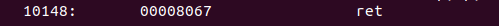

# Task 3 – RISC-V Instruction Format and 32-bit Encoding

This task involves identifying and decoding 15 unique RISC-V instructions from a compiled ELF binary. Each instruction is disassembled, and its format is analyzed based on the RISC-V specification. This includes determining the instruction type (R/I/S/B/U/J), extracting fields such as opcode, funct3, rs1, rs2, rd, and immediate values, and representing the 32-bit instruction layout.


## 1. Instruction Format Types

RISC-V instructions are categorized into six standard types, each designed for different purposes based on how they organize fields like registers, opcodes, and immediate values.

| Type   | Purpose                         | Example Instructions      |
|--------|----------------------------------|----------------------------|
| R-type | Register arithmetic             | `add`, `sub`, `and`, `sll` |
| I-type | Immediate arithmetic, loads     | `addi`, `lw`, `jalr`       |
| S-type | Store to memory                 | `sw`, `sh`, `sb`           |
| B-type | Conditional branches            | `beq`, `bne`, `blt`        |
| U-type | Load upper immediate            | `lui`, `auipc`             |
| J-type | Jump and link                   | `jal`                      |

Each type has a unique layout of fields and is used based on the instruction's behavior and operands.

## 2. Common Instruction Fields

| Field    | Description                                         |
|----------|-----------------------------------------------------|
| `opcode` | Identifies instruction type (e.g., `0110011` for R) |
| `rd`     | Destination register                                |
| `rs1`    | First source register                               |
| `rs2`    | Second source register                              |
| `funct3` | Specifies operation (along with opcode)             |
| `funct7` | Further refines operation (in R-type)               |
| `imm`    | Immediate constant value                            |

## 3. Instruction Format Layouts


### R-Type (Register Operations)

Used for register-to-register ALU operations.

| Field   | funct7 | rs2 | rs1 | funct3 | rd  | opcode |
|---------|--------|-----|-----|--------|-----|--------|
| Bits    | 7      | 5   | 5   | 3      | 5   | 7      |
| Range   | 31–25  |24–20|19–15|14–12   |11–7 |6–0     |

**Example:** `add x1, x2, x3`  
- `opcode`: 0110011  
- `funct3`: 000  
- `funct7`: 0000000

### I-Type (Immediate, Load)

Used for immediate arithmetic, loads, and some control instructions.

| Field   | imm[11:0]  | rs1 | funct3 | rd  | opcode |
|---------|------------|-----|--------|-----|--------|
| Bits    | 12         | 5   | 3      | 5   | 7      |
| Range   | 31–20      |19–15|14–12   |11–7 |6–0     |

**Example:** `addi x1, x2, 10` 
- Adds 10 to `x2` and stores in `x1` 
- `opcode`: 0010011  
- Immediate is in bits [31:20]

**C extraction:**
```c
int32_t imm_i = ((int32_t)instruction) >> 20;
```
```c
uint32_t imm_i_unsigned = (instruction >> 20) & 0xFFF;
```

### S-Type (Store Instructions)

Used for memory store operations.

| Field   | imm[11:5] | rs2 | rs1 | funct3 | imm[4:0] | opcode |
|---------|-----------|-----|-----|--------|----------|--------|
| Bits    | 7         | 5   | 5   | 3      | 5        | 7      |
| Range   | 31–25     |24–20|19–15|14–12   |11–7      |6–0     |


**Example:** `sw x5, 8(x6)`  
- Stores `x5` at memory address `x6 + 8`  
- `opcode`: 0100011  
- Immediate split: high 7 bits [31:25], low 5 bits [11:7]

### B-Type (Branch Instructions)

Used for conditional branches.

| Field   | imm[12] | imm[10:5] | rs2 | rs1 | funct3 | imm[4:1] | imm[11] | opcode |
|---------|---------|-----------|-----|-----|--------|-----------|----------|--------|
| Bits    | 1       | 6         | 5   | 5   | 3      | 4         | 1        | 7      |
| Range   | 31      | 30–25     |24–20|19–15|14–12   |11–8       |7         |6–0     |


**Example:** `beq x1, x2, offset`  
- Branches if `x1 == x2`  
- `opcode`: 1100011

Note: The final immediate is sign-extended and left-shifted by 1 (`imm <<= 1`) to get byte offset.


**C extraction:**
```c
imm = ((instruction >> 31) & 0x1) << 12 |
      ((instruction >> 25) & 0x3F) << 5 |
      ((instruction >> 8) & 0xF) << 1 |
      ((instruction >> 7) & 0x1) << 11;
```

### U-Type (Upper Immediate)

Used to load a 20-bit immediate to upper bits.

| Field   | imm[31:12]          | rd  | opcode |
|---------|---------------------|-----|--------|
| Bits    | 20                  | 5   | 7      |
| Range   | 31–12               |11–7 |6–0     |


**Example:** `lui x5, 0x12345`  
- Loads `0x12345 << 12` into `x5`  
- `opcode`: 0110111

**C extraction:**
```c
uint32_t imm_u = instruction & 0xFFFFF000;
```

### J-Type (Jump and Link)

Used for unconditional jumps with link.

| Field   | imm[20] | imm[10:1] | imm[11] | imm[19:12] | rd  | opcode |
|---------|---------|-----------|----------|-------------|-----|--------|
| Bits    | 1       | 10        | 1        | 8           | 5   | 7      |
| Range   | 31      | 30–21     | 20       | 19–12       |11–7 |6–0     |


**Example:** `jal x1, offset`  
- Jumps to `PC + offset`, stores return address in `x1`  
- `opcode`: 1101111

Note: The final immediate is sign-extended and left-shifted by 1 to get the jump offset.

**C extraction:**
```c
int32_t imm_j = ((instruction >> 31) & 0x1) << 20 |
                ((instruction >> 21) & 0x3FF) << 1 |
                ((instruction >> 20) & 0x1) << 11 |
                ((instruction >> 12) & 0xFF) << 12;

// Sign extension
if (imm_j & 0x100000)
    imm_j |= 0xFFE00000;
```

## 4. Instruction Behavior Examples

| Instruction       | Format | Operation Description                        |
|-------------------|--------|----------------------------------------------|
| `add x1, x2, x3`  | R-type | Adds `x2 + x3 → x1`                          |
| `addi x1, x2, 10` | I-type | Adds `x2 + 10 → x1`                          |
| `lw x5, 4(x6)`    | I-type | Loads memory at `x6 + 4` → `x5`              |
| `sw x5, 8(x6)`    | S-type | Stores `x5` at `x6 + 8`                      |
| `beq x1, x2, off` | B-type | Branches if `x1 == x2`                       |
| `lui x3, 0x10000` | U-type | Loads `0x10000 << 12` into `x3`              |
| `jal x1, offset`  | J-type | Jumps to address, stores return addr in `x1` |

## 5. Optional RV32I Extensions

RISC-V is modular. The following extensions enhance RV32I with more operations:

| Extension | Description                        | Example Instructions     |
|-----------|------------------------------------|--------------------------|
| M         | Integer multiply/divide            | `mul`, `div`, `rem`      |
| A         | Atomic instructions                | `lr.w`, `sc.w`           |
| F/D/Q     | Floating-point (32/64/128-bit)     | `flw`, `fsd`, `fmadd.d`  |
| C         | Compressed 16-bit instructions     | `c.addi`, `c.sw`, `c.jal`|
| Zicsr     | CSR access and manipulation        | `csrrw`, `csrrc`         |


## Source C Code

The following C code was compiled using the RISC-V GCC toolchain to generate ELF and disassembly for instruction decoding.

---

```c
#include <stdio.h>

int arr[15];

int main() {
    int i, sum = 0;

    printf("Odd numbers from 1 to 30:\n");
    for(i = 0; i < 15; i++) {
        arr[i] = 2 * i + 1;
    }

    for(i = 0; i < 15; i++) {
        printf("%d ", arr[i]);
        sum += arr[i];
    }

    printf("\nSum of odd numbers from 1 to 30: %d\n", sum);

    return 0;
}
```

### Native Compilation and Execution

Compile using GCC:

```bash
gcc sum_odd_no.c
./a.out
```
Expected output:

```
Odd numbers from 1 to 30: 1 3 5 7 9 11 13 15 17 19 21 23 25 27 29 
Sum of odd numbers from 1 to 30: 225
```
### RISC-V Compilation

Using RISC-V toolchain to compile with different optimization levels.


With -O1 optimization:

```bash
riscv64-unknown-elf-gcc -O1 -march=rv64im -mabi=lp64 -o sum_odd_no.o sum_odd_no.c
```

With -Ofast optimization:

```bash
riscv64-unknown-elf-gcc -Ofast -march=rv64im -mabi=lp64 -o sum_odd_no.o sum_odd_no.c
```
### Disassembly Using objdump

```bash
riscv64-unknown-elf-objdump -d sum_odd_no.o | less
```
Or save to a file for easier analysis:

```bash
riscv64-unknown-elf-objdump -d sum_odd_no.o > disas.txt
```
---

## RISC-V Instruction Breakdown


---

### 1. Instruction: `sext.w a5, s1`


- **Opcode**: 0111011 (7 bits)
- **rd (a5 = x15)**: 01111 (5 bits)
- **funct3**: 000 (3 bits)
- **rs1 (s1 = x9)**: 01001 (5 bits)
- **rs2**: 00000 (5 bits)
- **funct7**: 0000000 (7 bits)

**Machine Code**: `0004879b`  
**Type**: R-type

**Bitwise Layout**:  
`0000000 01001 00000 000 01111 0111011`

---

### 2. Instruction: `addw s2, a5, s2`


- **Opcode**: 0111011 (7 bits)
- **rd (s2 = x18)**: 10010
- **funct3**: 000
- **rs1 (a5 = x15)**: 01111
- **rs2 (s2 = x18)**: 10010
- **funct7**: 0000000

**Machine Code**: `0127893b`  
**Type**: R-type

**Bitwise Layout**:  
`0000000 10010 01111 000 10010 0111011`

---

### 3. Instruction: `addi sp, sp, -48`


- **Opcode**: 0010011
- **rd (sp = x2)**: 00010
- **funct3**: 000
- **rs1 (sp = x2)**: 00010
- **Immediate (-48)**: 11111111110010000

**Machine Code**: `fd010113`  
**Type**: I-type

**Bitwise Layout**:  
`111111111100 00010 000 00010 0010011`

---

### 4. Instruction: `addi a0, a0, -656`


- **Opcode**: 0010011
- **rd (a0 = x10)**: 01010
- **funct3**: 000
- **rs1 (a0 = x10)**: 01010
- **Immediate (-656)**: 1111110100110000

**Machine Code**: `d7050513`  
**Type**: I-type

**Bitwise Layout**:  
`111101000111 01010 000 01010 0010011`

---

### 5. Instruction: `addiw s1, s1, 2`


- **Opcode**: 0011011
- **rd (s1 = x9)**: 01001
- **funct3**: 000
- **rs1 (s1 = x9)**: 01001
- **Immediate**: 000000000010

**Machine Code**: `0024849b`  
**Type**: I-type

**Bitwise Layout**:  
`000000000010 01001 000 01001 0011011`

---

### 6. Instruction: `mv a1, a5` (Pseudo)  
> Real: `addi a1, a5, 0`


- **Opcode**: 0010011
- **rd (a1 = x11)**: 01011
- **funct3**: 000
- **rs1 (a5 = x15)**: 01111
- **Immediate**: 000000000000

**Machine Code**: `00078593`  
**Type**: I-type

**Bitwise Layout**:  
`000000000000 01111 000 01011 0010011`

---

### 7. Instruction: `bne s0, s4, 100f0`


- **Opcode**: 1100011
- **funct3**: 001
- **rs1 (s0 = x8)**: 01000
- **rs2 (s4 = x20)**: 10100
- **Immediate (offset = -12)**: `imm[12|10:5|4:1|11]` → `1 111100 - 0011 0` = -12

**Machine Code**: `fd441ee3`  
**Type**: B-type

**Bitwise Layout**:  
`1 111100 10100 01000 001 00110 1100011`

---

### 8. Instruction: `sw a5, 0(s0)`


- **Opcode**: 0100011
- **funct3**: 010
- **rs1 (s0 = x8)**: 01000
- **rs2 (a5 = x15)**: 01111
- **Immediate (0)**: 000000000000

**Machine Code**: `00f42023`  
**Type**: S-type

**Bitwise Layout**:  
`0000000 01111 01000 010 00000 0100011`

---

### 9. Instruction: `sd s4, 0(sp)`


- **Opcode**: 0100011
- **funct3**: 011
- **rs1 (sp = x2)**: 00010
- **rs2 (s4 = x20)**: 10100
- **Immediate (0)**: 000000000000

**Machine Code**: `01413023`  
**Type**: S-type

**Bitwise Layout**:  
`0000000 10100 00010 011 00000 0100011`

---

### 10. Instruction: `lw a5, 0(s0)`


- **Opcode**: 0000011
- **rd (a5 = x15)**: 01111
- **funct3**: 010
- **rs1 (s0 = x8)**: 01000
- **Immediate**: 000000000000

**Machine Code**: `00042783`  
**Type**: I-type

**Bitwise Layout**:  
`000000000000 01000 010 01111 0000011`

---

### 11. Instruction: `ld ra, 40(sp)`


- **Opcode**: 0000011
- **rd (ra = x1)**: 00001
- **funct3**: 011
- **rs1 (sp = x2)**: 00010
- **Immediate**: 000000000101000

**Machine Code**: `02813083`  
**Type**: I-type

**Bitwise Layout**:  
`000000000101000 00010 011 00001 0000011`

---

### 12. Instruction: `lui a0, 0x21`


- **Opcode**: 0110111
- **rd (a0 = x10)**: 01010
- **Immediate (upper 20 bits)**: 00000000001000010000

**Machine Code**: `00021537`  
**Type**: U-type

**Bitwise Layout**:  
`00000000001000010000 01010 0110111`

---

### 13. Instruction: `lui s0, 0x24`


- **Opcode**: 0110111
- **rd (s0 = x8)**: 01000
- **Immediate**: 00000000001001000000

**Machine Code**: `00024437`  
**Type**: U-type

**Bitwise Layout**:  
`00000000001001000000 01000 0110111`

---

### 14. Instruction: `jal ra, 10478`


- **Opcode**: 1101111
- **rd (ra = x1)**: 00001
- **Immediate (offset = 3924 / 0xF5C)**: 0011 0101 0100 0000 0000

**Machine Code**: `354000ef`  
**Type**: J-type

**Bitwise Layout**:  
`imm[20|10:1|11|19:12] 00001 1101111`

---

### 15. Instruction: `jal ra, 10478` 



- **Opcode**: 1101111
- **rd (ra = x1)**: 00001
- **Immediate (offset = 920)**: 0000 0011 1001 1000 0000

**Machine Code**: `398000ef`  
**Type**: J-type

**Bitwise Layout**:  
`imm[20|10:1|11|19:12] 00001 1101111`

---

