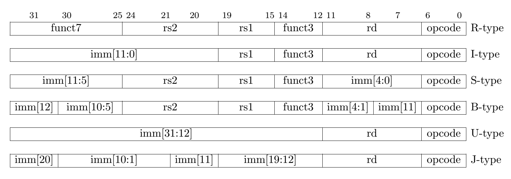

## RISC-V Instruction Formats

### 1. Instruction Format Types

| Type   | Purpose                         | Typical Instructions     |
|--------|----------------------------------|---------------------------|
| R-type | Register arithmetic              | add, sub, and, sll        |
| I-type | Immediate arithmetic, loads      | addi, lw, jalr            |
| S-type | Store to memory                  | sw, sb, sh                |
| B-type | Conditional branches             | beq, bne, blt             |
| U-type | Load immediate to upper bits     | lui, auipc                |
| J-type | Jumps with link                  | jal                       |

---

### 2. Field Layout by Format




#### R-Type

| funct7 | rs2 | rs1 | funct3 | rd | opcode |
|--------|-----|-----|--------|----|--------|
| 7 bits |  5  |  5  |   3    | 5  |   7    |

Used for register-to-register ALU operations.

#### I-Type

| imm[11:0] | rs1 | funct3 | rd | opcode |
|-----------|-----|--------|----|--------|
|  12 bits  |  5  |   3    | 5  |   7    |

Used for immediate arithmetic, loads, jalr, and system instructions.

#### S-Type

| imm[11:5] | rs2 | rs1 | funct3 | imm[4:0] | opcode |
|-----------|-----|-----|--------|----------|--------|
|   7 bits  |  5  |  5  |   3    |   5      |   7    |

Used for memory store operations.

#### B-Type

| imm[12] | imm[10:5] | rs2 | rs1 | funct3 | imm[4:1] | imm[11] | opcode |
|---------|-----------|-----|-----|--------|-----------|----------|--------|
| 1 bit   | 6 bits    | 5   | 5   | 3      | 4 bits    | 1 bit   | 7 bits |

Used for conditional branches.

#### U-Type

| imm[31:12] | rd | opcode |
|------------|----|--------|
|  20 bits   | 5  | 7 bits |

Used for upper immediate operations.

#### J-Type

| imm[20] | imm[10:1] | imm[11] | imm[19:12] | rd | opcode |
|---------|-----------|---------|-------------|----|--------|
| 1 bit   | 10 bits   | 1 bit   | 8 bits      | 5  | 7 bits |

Used for jump and link.

---

### 3. Common Instructions and Encodings

#### Arithmetic (R-Type)

```assembly
add x1, x2, x3    # Adds x2 + x3 → x1
```

- opcode: `0110011`  
- funct3: `000`  
- funct7: `0000000`

#### Immediate (I-Type)

```assembly
addi x1, x2, 10   # Adds x2 + 10 → x1
```

- opcode: `0010011`  
- funct3: `000`

#### Load/Store

```assembly
lw x5, 4(x6)      # Load word from x6 + 4 (I-type)
sw x5, 8(x6)      # Store x5 at x6 + 8 (S-type)
```

#### Branch

```assembly
beq x1, x2, offset  # Branch if equal
```

#### Upper Immediate

```assembly
lui x3, 0x10000     # Sets upper 20 bits of x3
auipc x4, 0x20000   # PC-relative address generation
```

#### Jump

```assembly
jal x1, offset      # Jump to offset, store return address in x1
```

---

### 4. Instruction Field Extraction (in C/C++)

#### Immediate Extraction (I-Type)

```c
uint32_t imm_i = (instruction >> 20) & 0xFFF;
```

#### U-Type Immediate

```c
uint32_t imm_u = instruction & 0xFFFFF000;
```

#### B-Type Immediate (Reassembled from fields)

```c
imm = ((instruction >> 31) & 0x1) << 12 |
      ((instruction >> 25) & 0x3F) << 5 |
      ((instruction >> 8) & 0xF) << 1 |
      ((instruction >> 7) & 0x1) << 11;
```

---

### 5. Optional Extensions in RV32I

| Extension | Description                    | Example Instructions       |
|-----------|--------------------------------|-----------------------------|
| M         | Integer Multiply/Divide        | mul, div, rem               |
| A         | Atomics                        | lr.w, sc.w                  |
| F/D/Q     | Floating-Point (32/64/128-bit) | flw, fsd                    |
| C         | Compressed (16-bit)            | c.addi, c.sw, c.jal         |
| Zicsr     | CSR Access/Manipulation        | csrrw, csrrs, csrrc         |
