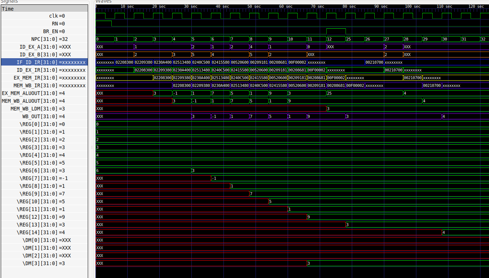

# Task 4 – Functional Simulation of RISC-V

By making use of **RISC-V Core: Verilog Netlist and Testbench**, perform an experiment of **Functional Simulation** and observe the waveforms.

**NOTE:** Since the designing of RISC-V Architecture and writing its testbench is **not** part of this Research Internship, we will use the Verilog Code and Testbench of RISC-V that has already been designed.  
The reference GitHub repository is: **iiitb_rv32i**

---

## Steps to perform functional simulation of RISC-V

1) **Create a new directory with your name**
```bash
mkdir <your_name>
```
Create two files using the touch command

	touch netlist.v netlist_tb.v

Copy the code from the reference GitHub repo and paste it into your netlist.v and netlist_tb.v files.

Run and simulate the Verilog code

	iverilog -o netlist netlist.v netlist_tb.v
	./netlist

View the simulation waveform in GTKWave

	gtkwave netlist.vcd

GTKWave will open and display the waveform window.

Important note on encodings

All the instructions in the provided Verilog are hard-coded.
Hard-coded means that instead of following the standard RISC-V bit patterns, the designer directly assigned 32-bit values.
Therefore, the 32-bit instructions generated in Task-2 will not match these hard-coded words.
Instructions – Standard vs Hardcoded (used in this core).

| MEM Address | Machine Code | Instruction        | Comment               |
|------------|--------------|------------------|----------------------|
| 0          | 32'h02208300 | add r6, r1, r2   | i1                   |
| 1          | 32'h02209380 | sub r7, r1, r2   | i2                   |
| 2          | 32'h0230a400 | and r8, r1, r3   | i3                   |
| 3          | 32'h02513480 | or r9, r2, r5    | i4                   |
| 4          | 32'h0240c500 | xor r10, r1, r4  | i5                   |
| 5          | 32'h02415580 | slt r11, r2, r4  | i6                   |
| 6          | 32'h00520600 | addi r12, r4, 5  | i7                   |
| 7          | 32'h00209181 | sw r3, r1, 2     | i8                   |
| 8          | 32'h00208681 | lw r13, r1, 2    | i9                   |
| 9          | 32'h00f00002 | beq r0, r0, 15   | i10                  |
| 25         | 32'h00210700 | add r14, r2, r2  | i11                  |

Below, each instruction is shown in the standard RISC-V field layout (opcode/rd/funct3/rs1/rs2/funct7) so the intent is clear, while the Machine Code line shows the hardcoded 32-bit word actually used in this core (from netlist_tb.v)

## RISC-V Instruction Breakdown

### 1. Instruction: add r6, r1, r2

- **Opcode:** 0110011  
- **rd (r6 = x6):** 00110  
- **funct3:** 000  
- **rs1 (r1 = x1):** 00001  
- **rs2 (r2 = x2):** 00010  
- **funct7:** 0000000  

**Machine Code:** `02208300`  
**Type:** R-type  

**Bitwise Layout:**
| Field   | funct7   | rs2    | rs1    | funct3 | rd     | opcode  |
|---------|----------|--------|--------|--------|--------|---------|
| Binary  | 0000000  | 00010  | 00001  | 000    | 00110  | 0110011 |

---

### 2. Instruction: sub r7, r1, r2

- **Opcode:** 0110011  
- **rd (r7 = x7):** 00111  
- **funct3:** 000  
- **rs1 (r1 = x1):** 00001  
- **rs2 (r2 = x2):** 00010  
- **funct7:** 0100000  

**Machine Code:** `02209380`  
**Type:** R-type  

**Bitwise Layout:**
| Field   | funct7   | rs2    | rs1    | funct3 | rd     | opcode  |
|---------|----------|--------|--------|--------|--------|---------|
| Binary  | 0100000  | 00010  | 00001  | 000    | 00111  | 0110011 |

---

### 3. Instruction: and r8, r1, r3

- **Opcode:** 0110011  
- **rd (r8 = x8):** 01000  
- **funct3:** 111  
- **rs1 (r1 = x1):** 00001  
- **rs2 (r3 = x3):** 00011  
- **funct7:** 0000000  

**Machine Code:** `0230a400`  
**Type:** R-type  

**Bitwise Layout:**
| Field   | funct7   | rs2    | rs1    | funct3 | rd     | opcode  |
|---------|----------|--------|--------|--------|--------|---------|
| Binary  | 0000000  | 00011  | 00001  | 111    | 01000  | 0110011 |

---

### 4. Instruction: or r9, r2, r5

- **Opcode:** 0110011  
- **rd (r9 = x9):** 01001  
- **funct3:** 110  
- **rs1 (r2 = x2):** 00010  
- **rs2 (r5 = x5):** 00101  
- **funct7:** 0000000  

**Machine Code:** `02513480`  
**Type:** R-type  

**Bitwise Layout:**
| Field   | funct7   | rs2    | rs1    | funct3 | rd     | opcode  |
|---------|----------|--------|--------|--------|--------|---------|
| Binary  | 0000000  | 00101  | 00010  | 110    | 01001  | 0110011 |

---

### 5. Instruction: xor r10, r1, r4

- **Opcode:** 0110011  
- **rd (r10 = x10):** 01010  
- **funct3:** 100  
- **rs1 (r1 = x1):** 00001  
- **rs2 (r4 = x4):** 00100  
- **funct7:** 0000000  

**Machine Code:** `0240c500`  
**Type:** R-type  

**Bitwise Layout:**
| Field   | funct7   | rs2    | rs1    | funct3 | rd     | opcode  |
|---------|----------|--------|--------|--------|--------|---------|
| Binary  | 0000000  | 00100  | 00001  | 100    | 01010  | 0110011 |

---

### 6. Instruction: slt r11, r2, r4

- **Opcode:** 0110011  
- **rd (r11 = x11):** 01011  
- **funct3:** 010  
- **rs1 (r2 = x2):** 00010  
- **rs2 (r4 = x4):** 00100  
- **funct7:** 0000000  

**Machine Code:** `02415580`  
**Type:** R-type  

**Bitwise Layout:**
| Field   | funct7   | rs2    | rs1    | funct3 | rd     | opcode  |
|---------|----------|--------|--------|--------|--------|---------|
| Binary  | 0000000  | 00100  | 00010  | 010    | 01011  | 0110011 |

---

### 7. Instruction: addi r12, r4, 5

- **Opcode:** 0010011  
- **rd (r12 = x12):** 01100  
- **funct3:** 000  
- **rs1 (r4 = x4):** 00100  
- **Immediate:** 000000000101  

**Machine Code:** `00520600`  
**Type:** I-type  

**Bitwise Layout:**
| Field   | imm[11:0]    | rs1    | funct3 | rd     | opcode  |
|---------|--------------|--------|--------|--------|---------|
| Binary  | 000000000101 | 00100  | 000    | 01100  | 0010011 |

---

### 8. Instruction: sw r3, r1, 2

- **Opcode:** 0100011  
- **funct3:** 010  
- **rs1 (r1 = x1):** 00001  
- **rs2 (r3 = x3):** 00011  
- **Immediate:** 000000000010  

**Machine Code:** `00209181`  
**Type:** S-type  

**Bitwise Layout:**
| Field   | imm[11:5] | rs2    | rs1    | funct3 | imm[4:0] | opcode  |
|---------|-----------|--------|--------|--------|----------|---------|
| Binary  | 0000000   | 00011  | 00001  | 010    | 00010    | 0100011 |

---

### 9. Instruction: lw r13, r1, 2

- **Opcode:** 0000011  
- **rd (r13 = x13):** 01101  
- **funct3:** 010  
- **rs1 (r1 = x1):** 00001  
- **Immediate:** 000000000010  

**Machine Code:** `00208681`  
**Type:** I-type  

**Bitwise Layout:**
| Field   | imm[11:0]    | rs1    | funct3 | rd     | opcode  |
|---------|--------------|--------|--------|--------|---------|
| Binary  | 000000000010 | 00001  | 010    | 01101  | 0000011 |

---

### 10. Instruction: beq r0, r0, 15

- **Opcode:** 1100011  
- **funct3:** 000  
- **rs1 (r0 = x0):** 00000  
- **rs2 (r0 = x0):** 00000  
- **Immediate:** 000000011110  

**Machine Code:** `00f00002`  
**Type:** B-type  

**Bitwise Layout:**
| Field        | imm[12] | imm[10:5] | rs2    | rs1    | funct3 | imm[4:1] | imm[11] | opcode  |
|--------------|---------|-----------|--------|--------|--------|-----------|---------|---------|
| Binary       | 0       | 000000    | 00000  | 00000  | 000    | 1110      | 0       | 1100011 |

---

### 11. Instruction: add r14, r2, r2

- **Opcode:** 0110011  
- **rd (r14 = x14):** 01110  
- **funct3:** 000  
- **rs1 (r2 = x2):** 00010  
- **rs2 (r2 = x2):** 00010  
- **funct7:** 0000000  

**Machine Code:** `00210700`  
**Type:** R-type  

**Bitwise Layout:**
| Field   | funct7   | rs2    | rs1    | funct3 | rd     | opcode  |
|---------|----------|--------|--------|--------|--------|---------|
| Binary  | 0000000  | 00010  | 00010  | 000    | 01110  | 0110011 |


### Execution & Output Summary (0–120 s)



| Time (s)  | Event / Signal Change |
|-----------|-----------------------|
| 0–10      | `IF_ID_IR = 02208300` (**add r6, r1, r2**) fetched; `ALUOUT = 3`; WB updates `REG[6] = 3`. |
| 10–20     | `IF_ID_IR = 02209380` (**sub r7, r1, r2**) fetched; `ALUOUT = -1`; WB updates `REG[7] = -1`. |
| 20–30     | `IF_ID_IR = 0230A400` (**and r8, r1, r3**) fetched; `ALUOUT = 1`; WB updates `REG[8] = 1`. |
| 30–40     | `IF_ID_IR = 02513480` (**or r9, r2, r5**) fetched; `ALUOUT = 7`; WB updates `REG[9] = 7`. |
| 40–50     | `IF_ID_IR = 0240C500` (**xor r10, r1, r4**) fetched; `ALUOUT = 5`; WB updates `REG[10] = 5`. |
| 50–60     | `IF_ID_IR = 02415580` (**slt r11, r2, r4**) fetched; `ALUOUT = 1`; WB updates `REG[11] = 1`. |
| 60–70     | `IF_ID_IR = 00520600` (**addi r12, r4, 5**) fetched; `ALUOUT = 9`; WB updates `REG[12] = 9`. |
| 70–80     | `IF_ID_IR = 00209181` (**sw r3, r1, 2**) fetched; MEM updates `DM[3] = 3`. |
| 80–90     | `IF_ID_IR = 00208681` (**lw r13, r1, 2**) fetched; `LDM = 3`; WB updates `REG[13] = 3`. |
| 90–100    | `IF_ID_IR = 00F00002` (**beq r0, r0, 15**) fetched; NPC jumps to 25. |
| 100–110   | Pipeline bubbles / branch flush. |
| 110–120   | `IF_ID_IR = 00210700` (**add r14, r2, r2**) fetched; `ALUOUT = 4`; WB updates `REG[14] = 4`. |


